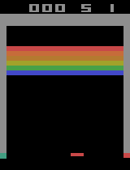
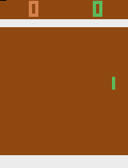
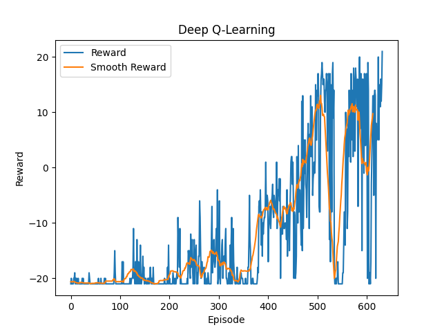
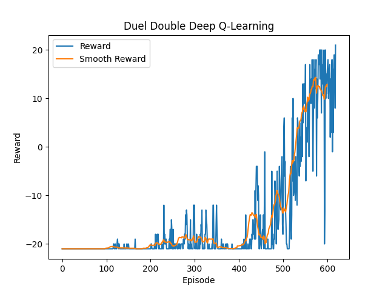

# Deep-Q-Learning
 Reinforcement Learning with PyTorch and OpenAI-Gym. This repository has implementation for [Deep-Q-Learning Algorithm](https://arxiv.org/abs/1312.5602) and [Dueling Double Deep-Q-Learning Algorithm](https://arxiv.org/abs/1511.06581). The CNNs have batch normalization layers to expedite the training process. With the current settings, training completes in ~4 hours (Ryzen7 + RTX3060) for both DQN and DDDQN. Training time is determined by the specified exploration frames. Maximum runtime memory requirement is ~8.5 GB (100k Memory Buffer) for training. Runtime memory requirement depends on the size of experience replay buffer. <br/>

 `main` branch has a preliminary implementation for `Cartpole` environment.


## Results
Before Training (Left) vs After Training (Right)
<p align="center">
  
  
</p>

<!-- Reward Graph
<p align="center">
  
  
</p> -->

## Install Dependencies
```bash
pip install -r requirements.txt
```

## Train 
Create folder for checkpoints
```bash
mkdir -p Checkpoints/Pong
```
Run DQN
```bash
python deep_q_learning.py
```
Run DDDQN
```bash
python duel_double_deep_q_learning.py
```

## Test
Set `MODEL_PATH` and `environment` parameters in `play_model.py`
```bash
python play_model.py
```

## Notes
- DQN is tricky and it takes numerous attempts and patience to get things working from scratch. For quicker results one can start with OpenAI baselines. However, trying from scratch provides deeper insights about parameters and their effect on the algorithm's performance.
- Pytorch specific: The target needs to be detached from the computation graph or the target Q values need to be calculated with `no_grad` scope during model optimization. This ensures that the optimizer does not update the weights of the target network during backpropagation.
- Gradient clipping and reward clipping can be used alternatively. Although gradient clipping results in faster training.
- Huber loss is an essential alternative for MSE loss. Simpler problems such as Cartpole and Pong where the planning horizon is short and the focus is more on immediate rewards, MSE loss performs fairly well. 
- Understanding the pre-processing is confusing. I would recommend to go through [this](https://danieltakeshi.github.io/2016/11/25/frame-skipping-and-preprocessing-for-deep-q-networks-on-atari-2600-games/) article to get a clear idea about how the Atari environments work. 
- Don't give up. Deep RL is frustratingly enjoyable and an engineering marvel.