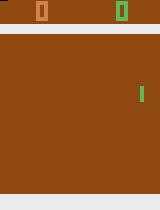
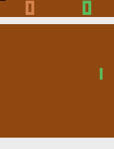

# Deep-Q-Learning
 Reinforcement Learning with PyTorch and OpenAI-Gym. This repository has implementation for [Deep-Q-Learning Algorithm](https://arxiv.org/abs/1312.5602) and [Dueling Double Deep-Q-Learning Algorithm](https://arxiv.org/abs/1511.06581). The CNNs have batch normalization layers to expedite the training process. With the current settings, training completes in ~4 hours for the DQN and ~3 hours for DDDQN. Training time is determined by the specified exploration frames. Maximum runtime memory requirement is ~13.5 GB for training. Runtime memory requirement depends on the size of experience replay buffer. <br/>

 `main` branch has a preliminary implementation for `Cartpole` environment.


## Results
Before Training (Left) vs After Training (Right)
<p align="center">
  
  
</p>

## Install Dependencies
```bash
pip install -r requirements.txt
```

## Train 
Create folder for checkpoints
```bash
mkdir -p Checkpoints/Pong
```
Run DQN
```bash
python deep_q_learning.py
```
Run DDDQN
```bash
python duel_double_deep_q_learning.py
```

## Test
Set `MODEL_PATH` and `environment` parameters in `play_model.py`
```bash
python play_model.py
```